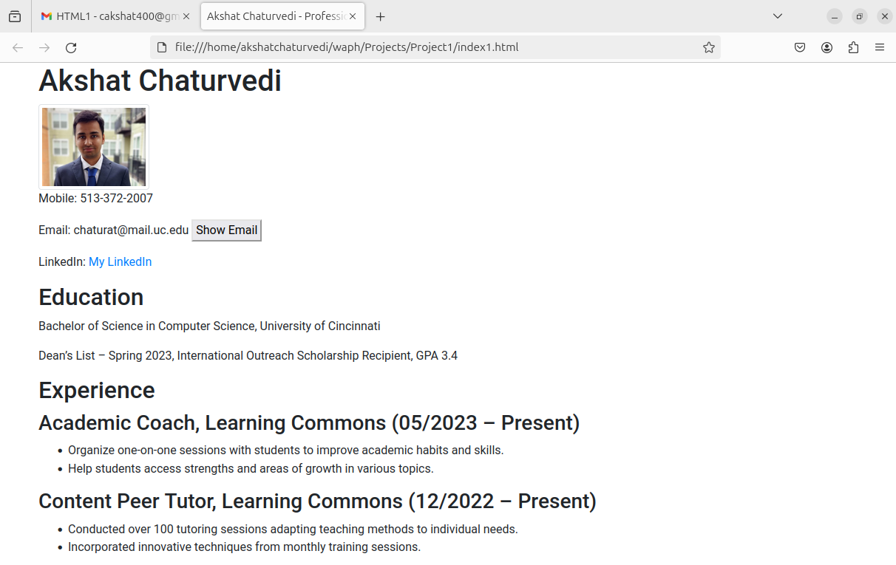
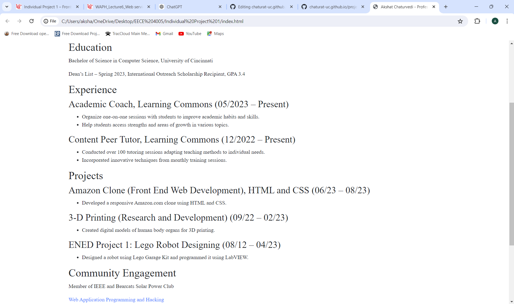
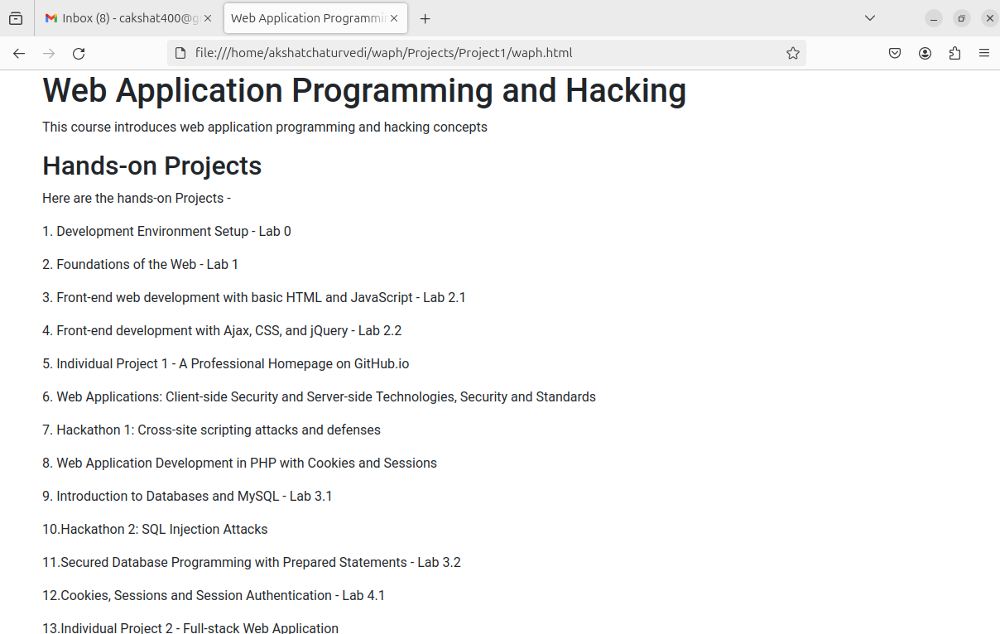
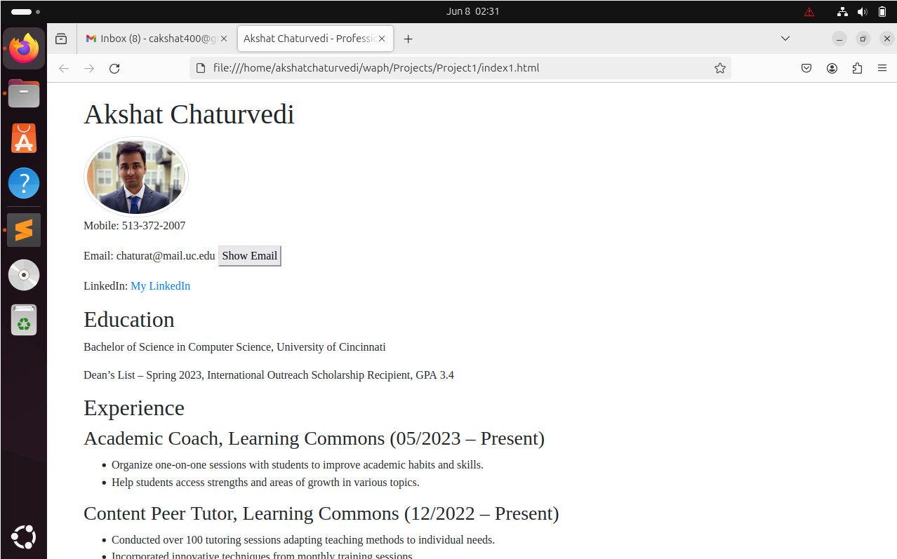
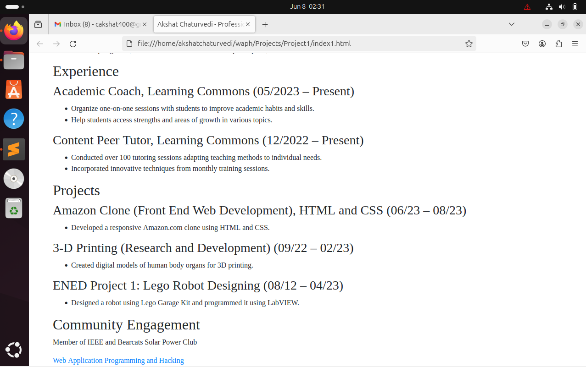
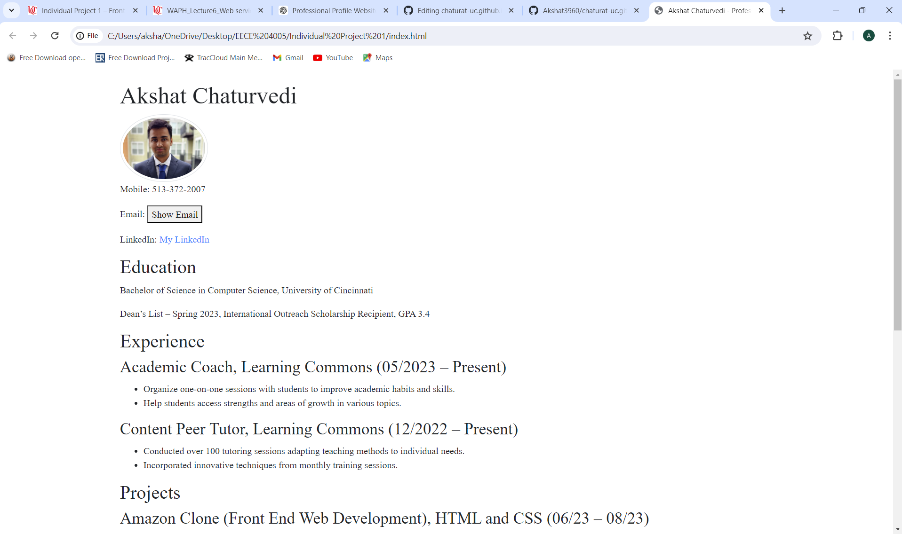
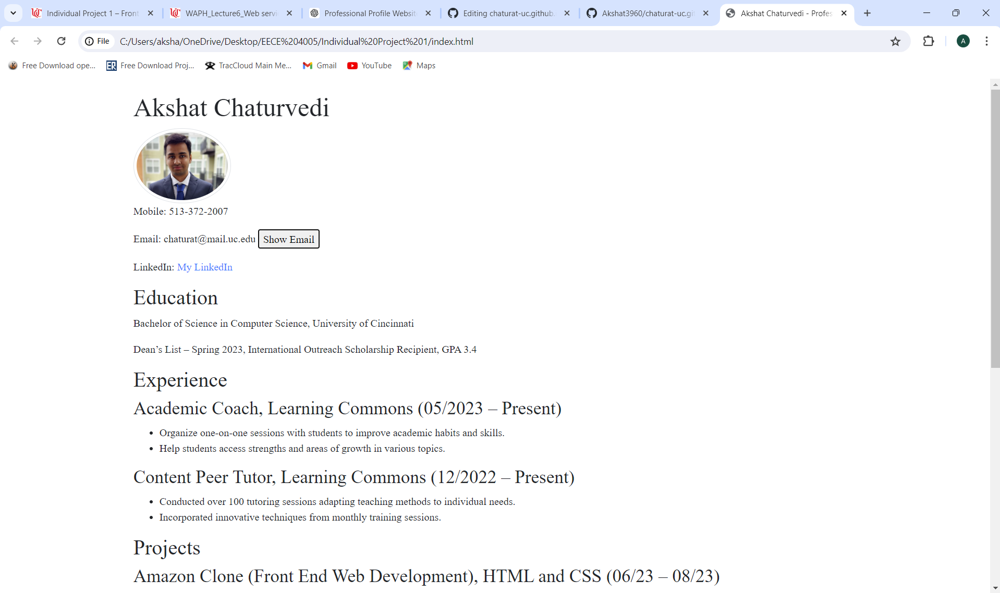
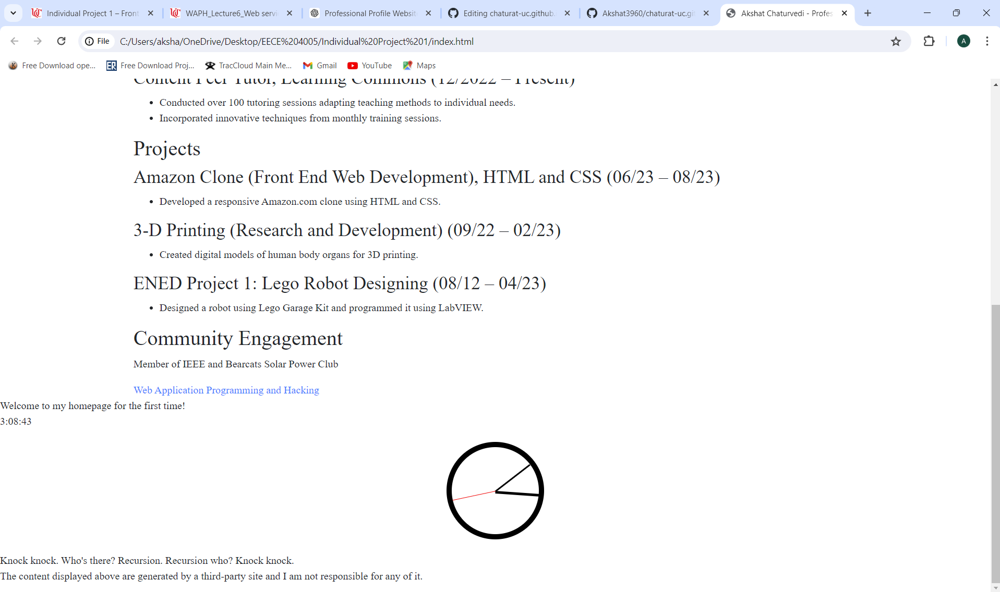

# WAPH - Web Application Programming and Hacking
## Instructor : Phu Phung
## Student
**Name**: Akshat Chaturvedi

**Email**: chaturat@mail.uc.edu

**Short-bio**: I have a keen interest in web development and data science.

 

## Repository Information

**Repository-URL**: https://github.com/Akshat3960/chaturat-uc.github.io 

## Front-End Web Development - Individual Project 1 
### Project Overview
In this project I have deployed a personal website on github.io using the front-end web development skills. I have included my resume, name, contact information,background,experience and skills. 

### General Requirements 

Firstly, I created a simple webpage using HTML in which I have included my headshot,name,contact information,background,education,experiences and skills and a link to the waph page introducing the web application programming and hacking course. I included a "Show email" button in it as well as a link to my linkedin Profile in the webpage.

Here is the code for it - 
```
<!DOCTYPE html> 
<head>
    <meta charset="UTF-8">
    <meta name="viewport" content="width=device-width, initial-scale=1.0">
    <title>Akshat Chaturvedi - Professional Profile</title>
    <link rel="stylesheet" href="https://stackpath.bootstrapcdn.com/bootstrap/4.5.2/css/bootstrap.min.css">
    <link rel="stylesheet" href="style.css">
    <script async src="https://www.googletagmanager.com/gtag/js?id=YOUR_TRACKING_ID"></script>
    <script>
      window.dataLayer = window.dataLayer || [];
      function gtag(){dataLayer.push(arguments);}
      gtag('js', new Date());
      gtag('config', 'YOUR_TRACKING_ID');
    </script>
</head>
<body>
    <div class="container">
        <h1>Akshat Chaturvedi</h1>
        
        <p>Mobile: 513-372-2007</p>
        <p>Email: <span id="email">chaturat@mail.uc.edu</span> <button id="showEmail">Show Email</button></p>
        <p>LinkedIn: <a href="http://www.linkedin.com/in/akshat-100ac">My LinkedIn</a></p>
        <h2>Education</h2>
        <p>Bachelor of Science in Computer Science, University of Cincinnati</p>
        <p>Dean’s List – Spring 2023, International Outreach Scholarship Recipient, GPA 3.4</p>
        <h2>Experience</h2>
        <h3>Academic Coach, Learning Commons (05/2023 – Present)</h3>
        <ul>
            <li>Organize one-on-one sessions with students to improve academic habits and skills.</li>
            <li>Help students access strengths and areas of growth in various topics.</li>
        </ul>
        <h3>Content Peer Tutor, Learning Commons (12/2022 – Present)</h3>
        <ul>
            <li>Conducted over 100 tutoring sessions adapting teaching methods to individual needs.</li>
            <li>Incorporated innovative techniques from monthly training sessions.</li>
        </ul>
        <h2>Projects</h2>
        <h3>Amazon Clone (Front End Web Development), HTML and CSS (06/23 – 08/23)</h3>
        <ul>
            <li>Developed a responsive Amazon.com clone using HTML and CSS.</li>
        </ul>
        <h3>3-D Printing (Research and Development) (09/22 – 02/23)</h3>
        <ul>
            <li>Created digital models of human body organs for 3D printing.</li>
        </ul>
        <h3>ENED Project 1: Lego Robot Designing (08/12 – 04/23)</h3>
        <ul>
            <li>Designed a robot using Lego Garage Kit and programmed it using LabVIEW.</li>
        </ul>
        <h2>Community Engagement</h2>
        <p>Member of IEEE and Bearcats Solar Power Club</p>
        <a href="waph.html">Web Application Programming and Hacking</a>
    </div>
```



Here is the code for waph.html page - 
```
<!DOCTYPE html> 
<head>
    <meta charset="UTF-8">
    <meta name="viewport" content="width=device-width, initial-scale=1.0">
    <title>Web Application Programming and Hacking</title>
    <link rel="stylesheet" href="https://stackpath.bootstrapcdn.com/bootstrap/4.5.2/css/bootstrap.min.css">
</head>
<body>
    <div class="container">
        <h1>Web Application Programming and Hacking</h1>
        <p>This course introduces web application programming and hacking concepts </p>
        <h2>Hands-on Projects</h2>
        <p>Here are the hands-on Projects - </p>
           
         <p> 1. Development Environment Setup - Lab 0 </p>
        <p>  2. Foundations of the Web - Lab 1 </p>
        <p>  3. Front-end web development with basic HTML and JavaScript - Lab 2.1 </p>
        <p>  4. Front-end development with Ajax, CSS, and jQuery - Lab 2.2 </p>
        <p>  5. Individual Project 1 - A Professional Homepage on GitHub.io </p>
        <p>  6. Web Applications: Client-side Security and Server-side Technologies, Security and Standards </p>
        <p>  7. Hackathon 1: Cross-site scripting attacks and defenses </p>
        <p>  8. Web Application Development in PHP with Cookies and Sessions </p>
        <p>  9. Introduction to Databases and MySQL - Lab 3.1 </p>
        <p>  10.Hackathon 2: SQL Injection Attacks </p>
        <p>  11.Secured Database Programming with Prepared Statements - Lab 3.2 </p>
        <p>  12.Cookies, Sessions and Session Authentication - Lab 4.1 </p>
        <p>  13.Individual Project 2 - Full-stack Web Application </p>
        <p>  14.Hackathon 3 - Session Hijacking Attacks </p>
        <p>  15.Database Modification & Team project </p>
        <p>  16.Hackathon 4: Cross-site Request Forgery Attacks </p>
        <p>  17.Database Access Control Team Project </p>
        <p>  18.Displaying Data Team Project </p>
        <p>  19.WebSocket and real-time web applications</p>
     
    </div>
</body>
</html>

```



The link is directed towards the page as shown in the screenshot above.

### Non-Technical Requirements

I used CSS for styling the headshot picture and change the font of the text in my webpage.

Here is the code for it - 
```
body {
    font-family: Times New Roman, sans-serif;
}

.container {
    margin-top: 20px;
}

.img-thumbnail {
    border-radius: 50%;
}

``` 




I have also included a page tracker in my web-page.

### Technical Requirements

I have written a javascript code using jQuery and moment library. I implemented the code for the digital clock,analog clock,showEmail button and the weather integration functionality. I styled the analog clock using CSS by adding the necessary functionalities in it. 

Here is the javascript code - 

```
$(document).ready(function(){ 
    $("#email").hide();
    $("#showEmail").click(function(){
        $("#email").toggle();
    });

    
    function updateClock() {
        var now = new Date();
        var hours = now.getHours();
        var minutes = now.getMinutes();
        var seconds = now.getSeconds();
        var timeString = hours + ':' + ('0' + minutes).slice(-2) + ':' + ('0' + seconds).slice(-2);
        $('#clock').text(timeString);
    }
    setInterval(updateClock, 1000);

    
    function updateAnalogClock() {
        var now = new Date();
        var seconds = now.getSeconds();
        var minutes = now.getMinutes();
        var hours = now.getHours();
        var secDeg = ((seconds / 60) * 360) + 90;
        var minDeg = ((minutes / 60) * 360) + ((seconds/60)*6) + 90;
        var hourDeg = ((hours / 12) * 360) + ((minutes/60)*30) + 90;
        $('.second').css('transform', 'rotate(' + secDeg + 'deg)');
        $('.minute').css('transform', 'rotate(' + minDeg + 'deg)');
        $('.hour').css('transform', 'rotate(' + hourDeg + 'deg)');
    }
    setInterval(updateAnalogClock, 1000);
    updateAnalogClock();
```

Here is the CSS code for styling of the analog clock - 

```
#analogClock {
    position: relative;
    width: 150px;
    height: 150px;
    border: 8px solid black;
    border-radius: 50%;
    margin: 20px auto;
}

#analogClock .hour, #analogClock .minute, #analogClock .second {
    position: absolute;
    width: 50%;
    background: black;
    top: 50%;
    transform-origin: 100%;
    transform: rotate(90deg);
    transition: transform 0.5s cubic-bezier(0.4, 2.3, 0.3, 1);
}

#analogClock .hour {
    height: 4px;
}

#analogClock .minute {
    height: 2px;
}

#analogClock .second {
    height: 1px;
    background: red;
}
``` 

After it, I added the jokeAPI integration in my javascript code for displaying programming related jokes. A new joke appears every next minute. Then, I implemented javascript cookies, in order to display a welcome statement when a user opens the page for the first time, also if the user opens the page again, it remembers the last time when the user opened the page and displays the date and time when the page last got opened.


Before pressing the showemail button

After pressing the showemail button



The image above shows the digital clock, analog clock and the programming joke displayed at the bottom. I have also included a disclaimer statement as the content of the joke is from a third-party source.
